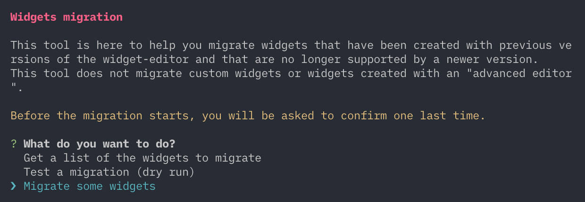
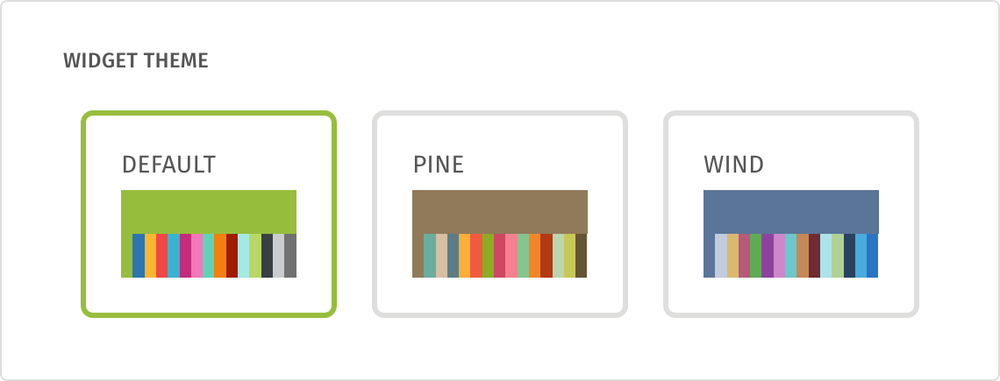

# widget-editor

This repository contains the code of the widget editor used in [Resource Watch](https://github.com/resource-watch/resource-watch) and [PREP](https://github.com/resource-watch/prep-app).

Initially developped for RW, the editor was then needed for PREP so it has been extracted in this repository. While exposing the React component by default, the package also contains a suite of components, services and styles that it needs and that can be re-used in other apps.

**⚠️ Please take the time to read the "Updating the widget-editor" section below before updating the dependency.**

## Get started

The widget editor needs a [React](https://reactjs.org) environment with [Redux](https://redux.js.org), as well as needs some peer dependencies to be installed:
```bash
$ yarn add react react-dom prop-types redux react-redux redux-thunk leaflet vega@^3.1.0
$ yarn add widget-editor
```

Note that [leaflet](http://leafletjs.com/) is not listed as a peer dependency of this package because you can load it from a CDN. Make sure Leaflet is bundled with your app or globally available as `window.L`.

You can [check the release tab](https://github.com/resource-watch/widget-editor/releases) on Github to see what is the most recent version.

*NOTE: you can either use npm or yarn.*

Your app must configure Redux' store so it uses the editor's reducers and [react-thunk](https://github.com/gaearon/redux-thunk):
```js
import { createStore, combineReducers, applyMiddleware } from 'redux';
import ReduxThunk from 'redux-thunk';
import { reducers } from 'widget-editor';

let store = createStore(
  combineReducers(reducers),
  {},
  applyMiddleware(ReduxThunk)
);
```

The reducers are: `widgetEditorModal`, `widgetEditorTooltip` and `widgetEditor`.

Finally, the library contains some external images you need to include in your build process. In your [webpack](https://webpack.js.org) configuration file, please add the following:
```js
const CopyWebpackPlugin = require('copy-webpack-plugin');

module.exports = {
  plugins: [
    new CopyWebpackPlugin([
      {
        from: 'node_modules/widget-editor/dist/images',
        to: 'images/'
      }
    ])
  ]
};
```

And don't forget to install the dev dependency:
```bash
$ yarn add copy-webpack-plugin --dev
```


### Configuration

You need to configure the library before using any of its components or services. You don't need to to it everytime you instance a new editor, so you can do it in your app's main file.

For example, here is how we do it in RW:
```js
import { setConfig } from 'widget-editor';

// Change the configuration according to your needs
setConfig({
  url: 'https://api.resourcewatch.org/v1',
  env: 'production,preproduction',
  applications: 'rw',
  authUrl: 'https://api.resourcewatch.org/auth',
  assetsPath: '/images/'
});
```

Here are all the options you can set:

Name | Default value | Mandatory | Description
-----|---------------|-----------|------------
`url: string` | `undefined` | Yes | Base URL of the API
`env: string` | `undefined` | Yes | Environment of the API (comma-separated string)
`applications: string` | `undefined` | Yes | Applications of the API (comma-separated string)
`authUrl: string` | `undefined` | Yes | URL to authenticate the user
`assetsPath: string` | `undefined` | Yes | Public path of the editor's static assets (images)
`userToken: string` | `null` | No | Token of the logged user
`userEmail: string` | `null` | No | Email of the logged user
`locale: string` | `"en"` | No | Locale used to fetch the data

Later, you can update any of the properties (mandatory or not) if you need to.

## Updating the widget-editor

This library follows the [semver specification](https://semver.org/). This means that only major versions will require you to update your code in order to maintain the functionality.

However, the widget-editor produces widgets that are very dependent on the version you use. Widgets created with an older version of the editor might be broken or have visual inconsistencies when opened with the `WidgetEditor` or `VegaChart` components of a newer version.

When updating the `widget-editor` dependency, please take the time to read the [Changelog](https://github.com/resource-watch/widget-editor/blob/develop/CHANGELOG.md). **Pay special attention to the versions in between the one you're using and the one you want to update to.** If one of the versions includes breaking changes, then you'll need to migrate the widgets.

### Migrating widgets



The widget-editor includes an easy-to-use CLI to run the migrations for you. Once you've selected the version you want to migrate to, the CLI gives you 3 choices:
- Get the list of the widgets that need migration
- Perform a dry-run of the migration
- Perform the migration

Then, the migration tool will ask you information such as which applications or which environments are targeted. If you want to perform the migration, you'll also have to provide your token (you need admin privileges).

Whatever option you select from the first screen, a complete report of the action will be generated in the folder you execute the command from.

To run the migration tool, from you host app, and with yarn, execute:
```bash
$ yarn --cwd node_modules/widget-editor/ run migrate
```

To run it with npm, execute:
```bash
$ npm explore widget-editor -- npm run migrate 
```

If you want to run it from the editor's repository, simply execute:
```bash
$ yarn migrate
```

## How to use the `WidgetEditor` component


### Setup

In addition to the editor's component, you must also include a few others needed to display the tooltips for example, as well as include the stylesheet.

The minimal setup is the following:
```jsx
import React from 'react';
import WidgetEditor, { Modal, Tooltip, Icons, setConfig } from 'widget-editor';
import 'widget-editor/dist/styles.min.css';

// Change the configuration according to your needs
setConfig({
  url: 'https://api.resourcewatch.org/v1',
  env: 'production,preproduction',
  applications: 'rw',
  authUrl: 'https://api.resourcewatch.org/auth'
});

const App = props => {
  return (
    <div>
      <Modal />
      <Tooltip />
      <Icons />
      <WidgetEditor datasetId="XXX" />
    </div>
  );
};

export default App;
```

### Props

Below is the list of props the `WidgetEditor` component takes:

Name | Default value | Mandatory | Version | Description
-----|---------------|-----------|---------|------------
`datasetId: string` | `undefined` | Yes | 0.0.1+ | The ID of the dataset to load the data from
`widgetId: string` | `undefined` | No | 0.0.1+ | If provided, the ID of the widget to edit
`widgetTitle: string` | `undefined` | No | 0.1.1+ | If provided, the title of the widget to edit. Use in conjunction with `onChangeWidgetTitle` to get a controlled input.
`widgetCaption: string` | `undefined` | No | 0.1.1+ | If provided, the caption of the widget to edit. Use in conjunction with `onChangeWidgetCaption` to get a controlled input.
`saveButtonMode: string` | `"auto"` | No | 0.0.1+ | If `"auto"`, the save/update button only appears if a user token is passed to the configuration. If `"always"`, the button is always shown. If `"never"`, the button never appears. **(1)**
`embedButtonMode: string` | `"auto"` | No | 0.0.6+ | If `"auto"`, the embed button only appears if a user token is passed to the configuration. If `"always"`, the button is always shown. If `"never"`, the button never appears. **(2)**
`titleMode: string` | `"auto"` | No | 0.0.1+ | If `"auto"`, the title _and_ caption are only editable if a user token is passed to the configuration. If `"always"`, the title _and_ caption are always editable. If `"never"`, they are always fixed.
`mapConfig: object` | `{ zoom: 3, lat: 0, lng: 0 }` | No | 0.0.4+ | Default state of the map. You can specify its `zoom`, `lat` and `lng`.
`contracted: boolean` | `false` | No | 1.1.0+ | Initially display the editor with its left panel contracted
`defaultTheme: object` | [Default theme](https://github.com/resource-watch/widget-editor/blob/develop/src/helpers/theme.js) | No | 1.4.0+ | Theme to apply to the Vega visualisations ([documentation](https://vega.github.io/vega/docs/config/)) by default, when no widget is provided or when it does not embed a theme **(4)**
`theme: object` | `undefined` | No | 1.4.0+ | Theme to apply to the Vega visualisations ([documentation](https://vega.github.io/vega/docs/config/)). It overrides the any other theme. **(4)**
`useLayerEditor: boolean`| `false` | No | 1.2.0+ | Let the user create a layer when selecting a map visualization
`allowBoundsCopyPaste: boolean`| `false` | No | 1.3.4+ | Let the user copy and paste the bounds of the map **(3)**
`onSave: function` | `undefined` | No | 0.0.1+ | Callback executed when the user clicks the save/update button.
`onEmbed: function` | `undefined` | No | 0.0.6+ | Callback executed when the user clicks the embed button. The first argument is the type of visualization to embed.
`onChangeWidgetTitle: function` | `undefined` | No | 0.1.1+ | Callback executed when the title of the widget is changed. The first argument is the new value.
`onChangeWidgetCaption: function` | `undefined` | No | 0.1.1+ | Callback executed when the caption of the widget is changed. The first argument is the new value.
`onChangeTheme: function` | `undefined` | No | 1.4.0+ | Callback executed when the user updates the colors of the theme or when a widget with embedded theme is initialized. The first argument is the new theme. **(5)**
`provideWidgetConfig: function` | `undefined` | No | 0.0.1+ | Callback which is passed a function to get the widget configuration (see below)
`provideLayer: function` | `undefined` | No | 1.2.0+ | Callback which is passed a function to get the layer created by the user, if any (see below)

**(1)** The button is **never** shown a widget hasn't been rendered yet.

**(2)** The button is currently only available for the table visualization.

**(3)** The bounds are copied within the `localStorage`, so the feature only work within the same site and as long as the browser's data is not cleared.

**(4)** Read "Understand how the themes work" below to get additional information about how the widget-editor handles the themes. The behavior changed from version 1.4.0.

**(5)** If not provided, the user won't be able to change the theme.

### Get the widget config

Once the user has created a widget and clicks the save button, you'll probably want to save it somewhere. In order to get the configuration of the widget, you need to pass a callback function to the editor as the prop `provideWidgetConfig`. This callback will receive as sole parameter a function to call to retrieve the widget config.

```jsx
let getWidgetConfig;

const App = props => {
  return (
    <WidgetEditor
      datasetId="XXX"
      provideWidgetConfig={(func) => { getWidgetConfig = func; }}
    />
  );
};
```

Once the editor has been mounted, `getWidgetConfig` can be used to retrieve the widget config:
```js
getWidgetConfig()
  .then((widgetConfig) => {
    // Here you are: 📊
  })
  .reject(() => {
    // Either the user hasn't created a widget yet or the process
    // failed to retrieve its configuration
  });
```

For more information about the `widgetConfig` object, take a look at [this Jupyter notebook](https://github.com/resource-watch/notebooks/blob/master/ResourceWatch/Api_definition/widget_definition.ipynb).

### Get the layer created by the user

First, you need to understand that if the prop `useLayerEditor` is not set, the user won't be able to create a layer.

If it is, then the user has the possibility to create a layer when choosing the map visualization. When the user clicks the save button, you can retrieve this layer calling the function passed by the `provideLayer` prop.

```jsx
let getLayer;

const App = props => {
  return (
    <WidgetEditor
      datasetId="XXX"
      useLayerEditor
      provideLayer={(func) => { getLayer = func; }}
    />
  );
};
```

Once the editor's mounted, whenever you want, you can call `getLayer`:
```js
getLayer()
  .then((layer) => {
    // Here you are: 🗺
  })
  .reject(() => {
    // This happens if you call the method when the map
    // hasn't been rendered yet
  });
```

For more information about the layers, check this [notebook](https://github.com/resource-watch/notebooks/blob/develop/ResourceWatch/Api_definition/layer_definition.ipynb).

### Understand how the themes work

Vega [defines an object](https://vega.github.io/vega/docs/config/) called `config` which stores information about how the different elements of the charts should look like. This is what we call here the theme.

The widget-editor has a [default theme](https://github.com/resource-watch/widget-editor/blob/develop/src/helpers/theme.js) which is applied when you don't provide one **(*)**. If you provide one via the `theme` prop, then this is the theme Vega will use (the widget-editor is a [controlled component](https://reactjs.org/docs/forms.html#controlled-components)).

**(*)** If you open a widget that has an embedded theme, it will be used instead of the widget-editor's default one. See below for more information.

#### How to embed a theme in a widget

When creating new widgets, you might want to save the theme along with the widgets. To do so, save the theme as a `config` object inside `widgetConfig`. You might want to give the theme a name, with a `name` attribute, so your host app can determine which theme is applied. This is particularly useful if you have a theme selector along with the widget-editor.



#### How to see a widget with its embedded theme

As you've read before, if you provide a theme to the widget-editor, this is the one Vega ends up using. In order to see the theme embedded in a widget, you need to pass `null` or `undefined` in the `theme` prop (or just omit the prop).

Nevertheless, your host app might use the widget-editor to open widgets that embed themes and others that don't. If you never pass a theme, then the widgets without an embedded theme will be displayed using the widget-editor's default theme. As you might want to have another theme for those, you should provide a default theme via the `defaultTheme` prop.

The `defaultTheme` prop provides a custom theme for the widgets that don't have any embedded one. But those which do will be displayed with their embedded theme. In that particular case, the `theme` prop is always set to `null` or `undefined` because otherwise, it would take precedence over the embedded theme of the widgets, your custom default theme and the widget-editor's default one.

Until the widget-editor has fully initialized the widget, your host app has no idea which theme the widget might embed. If you have a theme selector (see "How to embed a theme with a widget" above), you won't be able to mark any theme as active until then. When initialized, the widget-editor will execute the `onChangeTheme` callback right away, if provided and no theme is passed. See below for more details.

#### How to let the user customize the colors of the charts

You might want to let the user customize the colors of the charts. When enabled, the user can swap the order of the colors of the theme so particular elements (such as bars and points) get a specific color. If you want to enable it, please provide a callback to the `onChangeTheme` prop.

When the user changes a color, the callback is called with the new theme as argument. In order to give you a clear indication that that theme was changed, it will have the name "user-custom". This is particularly useful if you use a theme selector (see "How to embed a theme with a widget" above).

Since the widget-editor is a controlled component, you need to save this new theme in your host app (probably in the state of your component) and pass the new theme through the widget-editor's `theme` prop. Until you do so, the widget will still be displayed with its previous theme.

## How to use the `Modal` component
If you want to re-use the editor's modal in your app, you need to include the component within a non-positioned container (at the root for example). You can then open it with any content using its [redux' actions](https://github.com/resource-watch/widget-editor/blob/master/src/reducers/modal.js).

Your root component should look like this:
```jsx
import React from 'react';
import { Modal } from 'widget-editor';

const App = props => {
  return (
    <div>
      <Modal />
    </div>
  );
};

export default App;
```

## How to use the `Tooltip` component
Similarly to the `Modal` component, you can use the editor's tooltip inside your app by putting it in a root component (non-relatively positioned). Check out its [actions](https://github.com/resource-watch/widget-editor/blob/master/src/reducers/tooltip.js) to see how to open it.

Your root component should contain:
```jsx
import React from 'react';
import { Tooltip } from 'widget-editor';

const App = props => {
  return (
    <div>
      <Tooltip />
    </div>
  );
};

export default App;
```

## Exposed code

In addition to these 3 components, a dozen others and a few helper/services functions are exposed through the library. You can [see the whole list here](https://github.com/resource-watch/widget-editor/blob/master/index.js).

## Contribute
If you'd like to contribute to the project, clone the repository:
```bash
$ git clone git@github.com:resource-watch/widget-editor.git
```

Then, install the dependencies:
```bash
$ cd widget-editor && yarn
```

Build the project:
```bash
$ yarn build
```

And finally, execute this line to start the development server:
```bash
$ yarn start
```
Once you've done it, your browser should open a tab with a basic testing page.

You can also watch for the editor's JS files by typing this command in another terminal:
```bash
$ yarn watch
```

In you're favorite text editor, you can find the source code in `/src` and the testing file `/test.js`.

## Publish

**Before publishing, make sure to test the library. Once published to npm, there's no way to modify the new version or to take it down.**

Steps:
1. Update the changelog below with the new version number and the list of changes **(*)**
2. Tag the commit with the new version number: `git tag -a v0.0.X COMMIT_HASH` and add as description the list of changes from the changelog
3. Publish to npm: `yarn publish`

**(*)** Don't forget to remove the "Unreleased" text next to the version number and add the date of the release (DD/MM/YYYY)!

## [Changelog](https://github.com/resource-watch/widget-editor/blob/develop/CHANGELOG.md)
