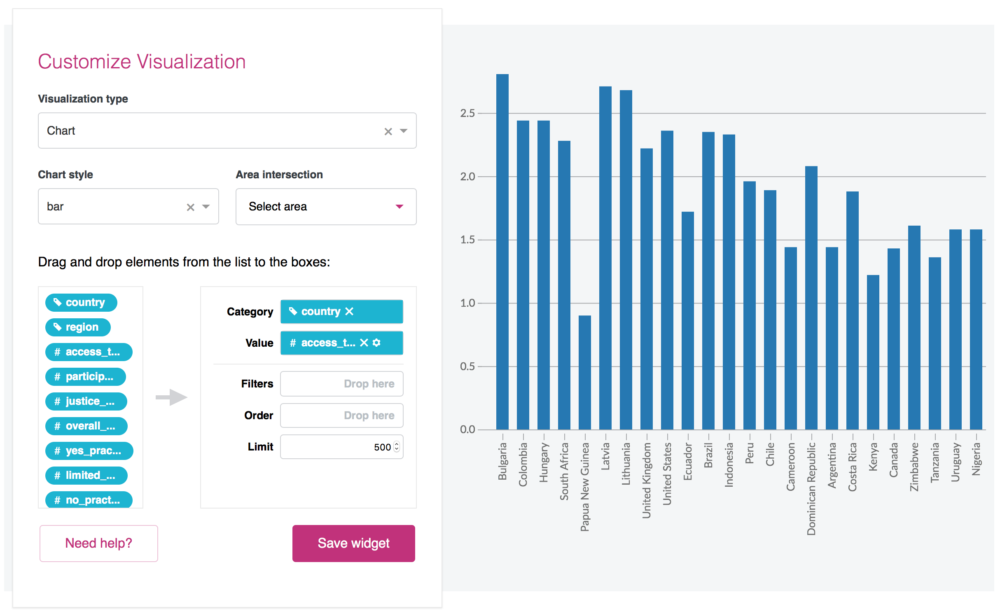

# widget-editor

This repository contains the code of the widget editor used in [Resource Watch](https://github.com/resource-watch/resource-watch) and [PREP](https://github.com/resource-watch/prep-app).

Initially developped for RW, the editor was then needed for PREP so it has been extracted in this repository. While exposing the React component by default, the package also contains a suite of components, services and styles that it needs and that can be re-used in other apps.

## Get started

The widget editor needs a [React](https://reactjs.org) environment with [Redux](https://redux.js.org), as well as needs some peer dependencies to be installed:
```bash
$ yarn add react react-dom prop-types redux react-redux redux-thunk leaflet vega@^2.6.5
$ yarn add widget-editor
```

You can [check the release tab](https://github.com/resource-watch/widget-editor/releases) on Github to see what is the most recent version.

*NOTE: you can either use npm or yarn.*

Your app must configure Redux' store so it uses the editor's reducers and [react-thunk](https://github.com/gaearon/redux-thunk):
```js
import { createStore, combineReducers, applyMiddleware } from 'redux';
import ReduxThunk from 'redux-thunk';
import { reducers } from 'widget-editor';

let store = createStore(
  combineReducers(reducers),
  {},
  applyMiddleware(ReduxThunk)
);
```

The reducers are: `widgetEditorModal`, `widgetEditorTooltip` and `widgetEditor`.

Finally, the library contains some external images you need to include in your build process. In your [webpack](https://webpack.js.org) configuration file, please add the following:
```js
const CopyWebpackPlugin = require('copy-webpack-plugin');

module.exports = {
  plugins: [
    new CopyWebpackPlugin([
      {
        from: 'node_modules/widget-editor/dist/images',
        to: 'images/'
      }
    ])
  ]
};
```

And don't forget to install the dev dependency:
```bash
$ yarn add copy-webpack-plugin --dev
```


### Configuration

You need to configure the library before using any of its components or services. You don't need to to it everytime you instance a new editor, so you can do it in your app's main file.

For example, here is how we do it in RW:
```js
import { setConfig } from 'widget-editor';

// Change the configuration according to your needs
setConfig({
  url: 'https://api.resourcewatch.org/v1',
  env: 'production,preproduction',
  applications: 'rw',
  authUrl: 'https://api.resourcewatch.org/auth',
  assetsPath: '/images/'
});
```

Here are all the options you can set:

Name | Default value | Mandatory | Description
-----|---------------|-----------|------------
`url: string` | `undefined` | Yes | Base URL of the API
`env: string` | `undefined` | Yes | Environment of the API (comma-separated string)
`applications: string` | `undefined` | Yes | Applications of the API (comma-separated string)
`authUrl: string` | `undefined` | Yes | URL to authenticate the user
`assetsPath: string` | `undefined` | Yes | Public path of the editor's static assets (images)
`userToken: string` | `null` | No | Token of the logged user
`userEmail: string` | `null` | No | Email of the logged user
`locale: string` | `"en"` | No | Locale used to fetch the data

Later, you can update any of the properties (mandatory or not) if you need to.

## How to use the `WidgetEditor` component



### Setup

In addition to the editor's component, you must also include a few others needed to display the tooltips for example, as well as include the stylesheet.

The minimal setup is the following:
```jsx
import React from 'react';
import WidgetEditor, { Modal, Tooltip, Icons, setConfig } from 'widget-editor';
import 'widget-editor/dist/styles.min.css';

// Change the configuration according to your needs
setConfig({
  url: 'https://api.resourcewatch.org/v1',
  env: 'production,preproduction',
  applications: 'rw',
  authUrl: 'https://api.resourcewatch.org/auth'
});

const App = props => {
  return (
    <div>
      <Modal />
      <Tooltip />
      <Icons />
      <WidgetEditor datasetId="XXX" />
    </div>
  );
};

export default App;
```

### Props

Below is the list of props the `WidgetEditor` component takes:

Name | Default value | Mandatory | Description
-----|---------------|-----------|------------
`datasetId: string` | `undefined` | Yes | The ID of the dataset to load the data from
`widgetId: string` | `undefined` | No | If provided, the ID of the widget to edit
`widgetTitle: string` | `undefined` | No | If provided, the title of the widget to edit. Use in conjunction with `onChangeWidgetTitle` to get a controlled input.
`widgetCaption: string` | `undefined` | No | If provided, the caption of the widget to edit. Use in conjunction with `onChangeWidgetCaption` to get a controlled input.
`saveButtonMode: string` | `"auto"` | No | If `"auto"`, the save/update button only appears if a user token is passed to the configuration. If `"always"`, the button is always shown. If `"never"`, the button never appears. **(1)**
`embedButtonMode: string` | `"auto"` | No | If `"auto"`, the embed button only appears if a user token is passed to the configuration. If `"always"`, the button is always shown. If `"never"`, the button never appears. **(2)**
`titleMode: string` | `"auto"` | No | If `"auto"`, the title _and_ caption are only editable if a user token is passed to the configuration. If `"always"`, the title _and_ caption are always editable. If `"never"`, they are always fixed.
`mapConfig: object` | `{ zoom: 3, lat: 0, lng: 0 }` | No | Default state of the map. You can specify its `zoom`, `lat` and `lng`.
`onSave: function` | `undefined` | No | Callback executed when the user clicks the save/update button.
`onEmbed: function` | `undefined` | No | Callback executed when the user clicks the embed button. The first argument is the type of visualization to embed.
`onChangeWidgetTitle: function` | `undefined` | No | Callback executed when the title of the widget is changed. The first argument is the new value.
`onChangeWidgetCaption: function` | `undefined` | No | Callback executed when the caption of the widget is changed. The first argument is the new value.
`provideWidgetConfig: function` | `undefined` | No | Callback which is passed a function to get the widget configuration (see below)

**(1)** The button is **never** shown a widget hasn't been rendered yet.

**(2)** The button is currently only available for the table visualization.

### Get the widget config

Once the user has created a widget and clicks the save button, you'll probably want to save it somewhere. In order to get the configuration of the widget, you need to pass a callback function to the editor as the prop `provideWidgetConfig`. This callback will receive as sole parameter a function to call to retrieve the widget config.

```jsx
let getWidgetConfig;

const App = props => {
  return (
    <WidgetEditor
      datasetId="XXX"
      provideWidgetConfig={(func) => { getWidgetConfig = func; }}
    />
  );
};
```

Once the editor has been mounted, `getWidgetConfig` can be used to retrieve the widget config:
```js
getWidgetConfig()
  .then((widgetConfig) => {
    // Here you are: 📊
  })
  .reject(() => {
    // Either the user hasn't created a widget yet or the process
    // failed to retrieve its configuration
  });
```

For more information about the `widgetConfig` object, take a look at [this Jupyter notebook](https://github.com/resource-watch/notebooks/blob/master/ResourceWatch/Api_definition/widget_definition.ipynb).


## How to use the `Modal` component
If you want to re-use the editor's modal in your app, you need to include the component within a non-positioned container (at the root for example). You can then open it with any content using its [redux' actions](https://github.com/resource-watch/widget-editor/blob/master/src/reducers/modal.js).

Your root component should look like this:
```jsx
import React from 'react';
import { Modal } from 'widget-editor';

const App = props => {
  return (
    <div>
      <Modal />
    </div>
  );
};

export default App;
```

## How to use the `Tooltip` component
Similarly to the `Modal` component, you can use the editor's tooltip inside your app by putting it in a root component (non-relatively positioned). Check out its [actions](https://github.com/resource-watch/widget-editor/blob/master/src/reducers/tooltip.js) to see how to open it.

Your root component should contain:
```jsx
import React from 'react';
import { Tooltip } from 'widget-editor';

const App = props => {
  return (
    <div>
      <Tooltip />
    </div>
  );
};

export default App;
```

## Exposed code

In addition to these 3 components, a dozen others and a few helper/services functions are exposed through the library. You can [see the whole list here](https://github.com/resource-watch/widget-editor/blob/master/index.js).

## Contribute
If you'd like to contribute to the project, clone the repository:
```bash
$ git clone git@github.com:resource-watch/widget-editor.git
```

Then, install the dependencies:
```bash
$ cd widget-editor && yarn
```

Build the project:
```bash
$ yarn build
```

And finally, execute this line to start the development server:
```bash
$ yarn start
```
Once you've done it, your browser should open a tab with a basic testing page.

You can also watch for the editor's JS files by typing this command in another terminal:
```bash
$ yarn watch
```

In you're favorite text editor, you can find the source code in `/src` and the testing file `/test.js`.

## Publish

**Before publishing, make sure to test the library. Once published to npm, there's no way to modify the new version or to take it down.**

Steps:
1. Update the changelog below with the new version number and the list of changes **(*)**
2. Tag the commit with the new version number: `git tag -a v0.0.X COMMIT_HASH` and add as description the list of changes from the changelog
3. Publish to npm: `yarn publish`

**(*)** Don't forget to remove the "(not yet released)" text next to the version number!

## Changelog

### v0.1.3
- Remove unused CSS rules that would interfere with the styles of RW or Prep
- Auto-pan to the bounding box of a layer, if provided
- Save and restore the bounding box of the widgets

### v0.1.2
- Fix a bug where the save button would appear with the table visualization and throw a controlled error when the user tries to get its config
- Remove React warning in the tooltip
- Fix a bug that would prevent the tooltip and the legend from displaying dates
- Remove the code that forced the tooltip to show the column "x" (only for the tooltips opened based on the horizontal position of the cursor)
- Fix a bug that would prevent `VegaChart` from re-rendering when the data's changed
- Fix a bug that would force the user to add an optional prop to `VegaChart`

### v0.1.1
- Improve the resilience of the tooltip of the Vega charts and allow more than two values to be displayed at once
- Show 'save' not 'update' when viewing default widgets in explore
- Autoselect the default layer, if present, in the `MapEditor` component
- Let the title of the widget being controlled from the outside
- Fix a bug where the `locale` attribute of the config wouldn't default to `"en"`
- Fix a bug where the columns wouldn't get their alias and description
- Autoselect the first available chart type when the visualization is "Chart"
- Add a caption to the editor, controllable from the outside and linked to the `titleMode` prop
- By default, let the chart's legend opened (if any)

### v0.1.0
- Fix a bug that prevented map widgets from being restored
- Add the missing Leaflet stylesheet to the testing file
- Add a watch mode for the JS files
- Remove external CSS for `rc-slider`
- Scope all of the CSS classes of the components (now they start with `c-we-` instead of just `c-`)

### v0.0.9
- Add the missing type to some buttons
- Add `rc-slider/assets/index.css` as required dependency

### v0.0.8
- Fix an issue that would prevent the update of the config
- Remove the `widgetConfig` prop of `SaveWidgetModal` and replace it by `getWidgetConfig`
- Fix the endpoint used in `removeUserWidget` from the `WidgetService`
- Fix issues with the auth token in `WidgetService`
- Build the library with [Rollup](https://rollupjs.org/) and make it SSR-ready
- Add a new attribute `assetsPath` to the configuration (mandatory)
- Scope the actions to avoid conflicts

### v0.0.7
- Remove the `widgetEditorExplore` reducer and actions
- Reduce the size of the library by 1% (-9kB) minified

### v0.0.6
- Add the `embedButtonMode` prop for the `WidgetEditor` component
- Add the `onEmbed` prop for the `WidgetEditor` component
- Possibility to use `EmbedTableModal` as an external component
- Fix a bug where the area intersection filter would display "Waiting for actions"
- Remove the need for `babel-polyfill`
- Reduce the size of the library by 53% (-997kB) minified

### v0.0.5
- Add missing params to the queries (`application` and `env`)

### v0.0.4
- Added an option to set the default state of the map

### v0.0.3
- External images use absolute URLs and documentation about how to configure webpack to load them
- Fixed bug that prevented layers from other apps than RW to be displayed
- Made the `userEmail` property optional in the configuration
- Scope the styles of the modal
- Fixed bug that would prevent the editor from correctly restoring some widgets

### v0.0.2

- Use react 15.x instead of react 16

### v0.0.1

Initial version of the library
